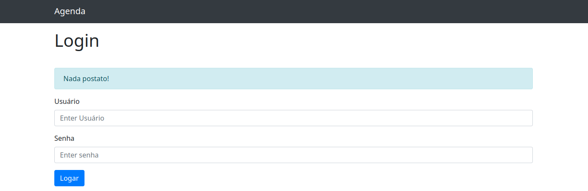
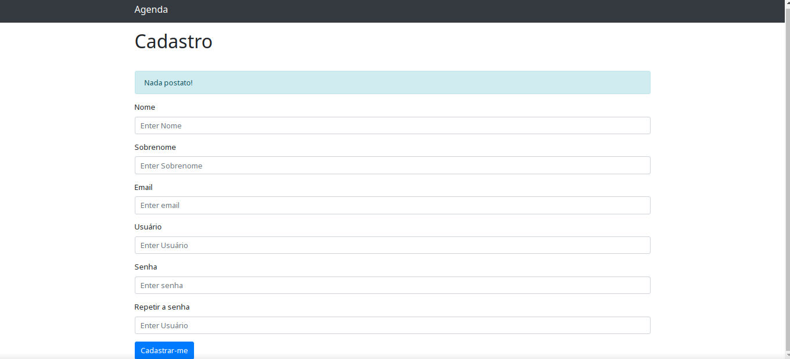
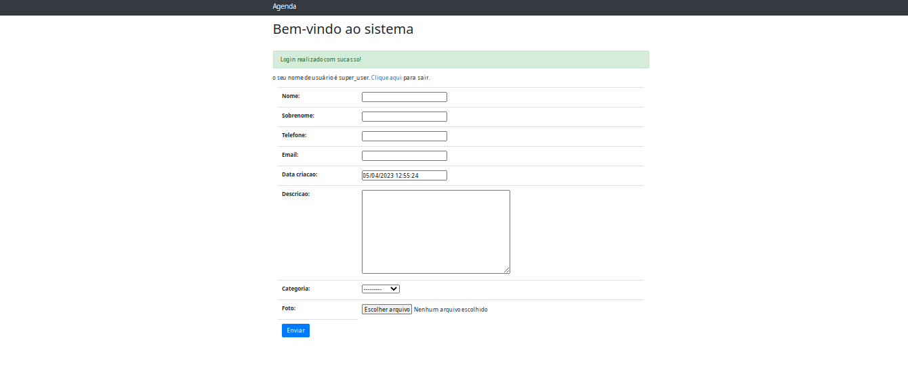
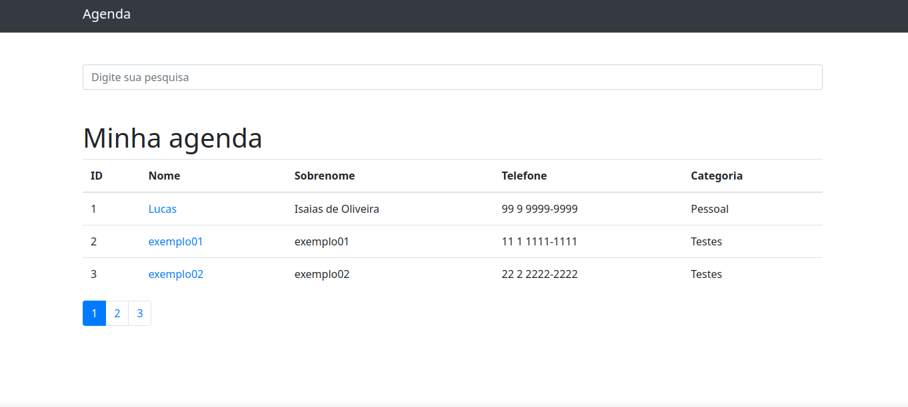
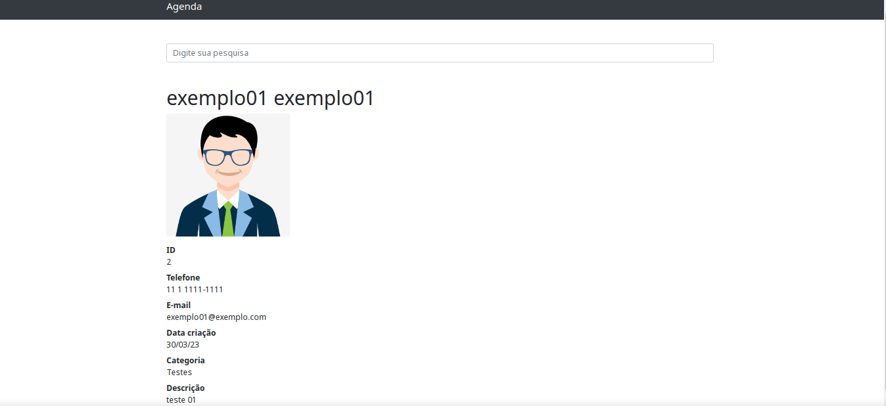

# Projeto Agenda de contatos.

Nesse repositório contém um projeto fullstack realizado o front-end com o BootStrap e o back-end com python e o framework
Django.

O projeto consiste em um sistema (CRUD) agenda de contatos, onde o usuário do sistema consegue realizar login no sistema,
cadastrar novos usuário, cadastrar novos contatos na agenda e visualizar todos os contatos cadastrados em um dashboard.

exemplos:

- Rota para login (accounts/login/);
- Rota para cadastro de usuário (accounts/cadastro/);
- Rota para o dashboard, obs: essa roda é acessível se o usuário estiver logado (accounts/dashboard/);
- Rota para o index que é a visualização dos dados dos contatos cadastrados;
- Rota para visualização de um contato específico.

### Pré-requisitos

- Python
- O banco de dados é de sua escolha, mas nesse projeto utilizei o SQLite
- Instalação dos requirements.txt disponibilizados
- (Não é obrigatório para que o sistema funcione.) Criação de um superusuário para acesso da áre administrativa do Django. ou se preferir
pode usar o que já foi criado para teste (usuário: super_user | Senha: superuser00)

### Execução do sistema

- Basta entrar no diretório do sistema e no terminal rodar o comando: python manage.py runserver
e o retorno é o http da página (index);
- Para acessar as outras rotas do sistema terá que colocar a url manualmente como está no exemplo logo abaixo.

### Exemplo da execução

#### Rota para login (accounts/login/);

- Consta algumas validações, o formulário tem que estar preenchido
e com os dados certos para a liberação do acesso.

#### Rota para cadastro de usuário (accounts/cadastro/);

- Consta algumas validações, o formulário tem que estar preenchido,
o e-mail precisa ser um válido, o usuário precisa ter >= 6 caracteres,
a senha precisa ter >= 6 caracteres.

#### Rota para o dashboard (accounts/dashboard/);

- Obs: essa rota é acessível se o usuário estiver logado.
Aqui é onde o usuário LOGADO consegue cadastrar o seu contato,
o cadastro também conta com um campo onde consegue inserir uma imagem.

#### Rota para o index

-  Obs: é a rota padrão quando roda o sistema.
Aqui o usuário consegue ver uma lista de todos os seus contatos cadastrados,
conta com um sistema de paginação (limitei 3 contatos por página para exemplo),
também tem um campo de busca para filtrar melhor o contato que deseja informações,
caso o usuário precise de informações de um contato espefífico pode usar o campo de busca 
ou clicar no nome do contato que será redirecionado para uma página com informações 
somente desse contato.

